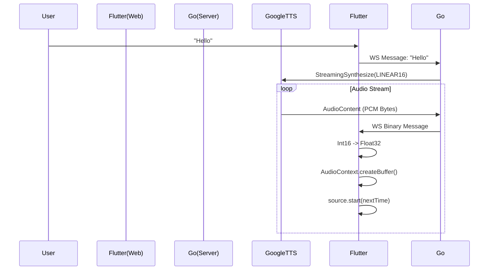

# Architecture & Findings

## Why "Streaming" is Hard on the Web

"Streaming" is an overloaded term.
1.  **Progressive Download:** Playing a file (MP3) while it downloads. Browsers handle this natively.
2.  **HLS/DASH:** Segmented files (TS/M4S) listed in a manifest. Standard for video.
3.  **Low-Latency Streaming:** Raw bytes arriving over a socket (WebSocket/WebRTC).

AI interactions (Voice Chat) require #3. You cannot wait for a full MP3 file to generate before playing.

## Failed Experiments (What didn't work)

### 1. MSE + MP3
We attempted to feed raw MP3 frames from Google TTS into a `SourceBuffer` (`audio/mpeg`).
*   **Result:** `PipelineStatus::CHUNK_DEMUXER_ERROR_APPEND_FAILED`.
*   **Reason:** Chrome's MP3 demuxer in MSE is strict. It expects specific framing or ID3 tags that raw TTS output lacks in the initial chunks.

### 2. MSE + Opus (Ogg)
We attempted to feed `OGG_OPUS` from Google TTS into `SourceBuffer` (`audio/webm; codecs="opus"`).
*   **Result:** Failure.
*   **Reason:** Ogg and WebM are different containers. Chrome MSE supports WebM, not Ogg. Transmuxing Ogg to WebM in JS/Dart is computationally expensive.

### 3. HTTP Chunked Transfer (MP3/WAV)
We attempted to proxy the TTS stream to an HTTP endpoint with `Transfer-Encoding: chunked`.
*   **Result:** Works but High Latency / API incompatibility.
*   **Issue:** `StreamingSynthesize` does not support MP3. Unary `SynthesizeSpeech` supports MP3 but isn't streaming. `LINEAR16` (WAV) works via HTTP but requires a WAV header, which is hard to generate if the total length is unknown (though `0` length works in some browsers).

## The Golden Path: Web Audio API

The robust solution for low-latency AI audio on the web is manual decoding.

### The Pipeline



### Key Implementation Details (`pcm_player.dart`)

1.  **AudioContext State:** Browsers suspend `AudioContext` until a user gesture. We must handle `resume()`.
2.  **Float32 Conversion:** Google sends `Int16` (Little Endian). Web Audio API expects `Float32` (-1.0 to 1.0).
    ```dart
    floatSample = int16Sample / 32768.0;
    ```
3.  **Gapless Scheduling:** We track `_nextPlayTime`.
    ```dart
    if (nextPlayTime < currentTime) nextPlayTime = currentTime; // Catch up
    source.start(nextPlayTime);
    nextPlayTime += buffer.duration;
    ```
    This ensures that even if packets arrive with jitter, they are scheduled contiguously.

## Gemini TTS & Streaming Limits

### The 512-Byte Context Limit
When using **Generative TTS models** (e.g., `gemini-2.5-flash-tts`) via `StreamingSynthesize`, there is an undocumented but strict limit on the "accumulated context" (input text + style prompt) of ~512 bytes. If a single gRPC stream is kept open and fed multiple sentences, the server treats the history as part of the generation prompt. Once this history exceeds ~512 bytes, the stream aborts with `INVALID_ARGUMENT`.

### The "One Sentence, One Stream" Strategy
To bypass this while maintaining a streaming UX, we implemented a **Producer-Consumer** architecture in Go:

1.  **Producer (Goroutine):**
    *   Consumes the Gemini Text Stream.
    *   Splits text into sentences.
    *   Sends text to Frontend immediately (via WebSocket).
    *   Pushes sentences to a buffered Go Channel (`sentenceChan`).
2.  **Consumer (Main Loop):**
    *   Reads from `sentenceChan`.
    *   **Re-initializes** the `StreamingSynthesize` connection for *each* sentence.
    *   This ensures the context is flushed, avoiding the 512-byte limit.
    *   Audio chunks are forwarded to the WebSocket in strict sequential order.

This "quantized streaming" approach provides the best of both worlds: low-latency text display and stable, high-quality generative audio for long stories.
